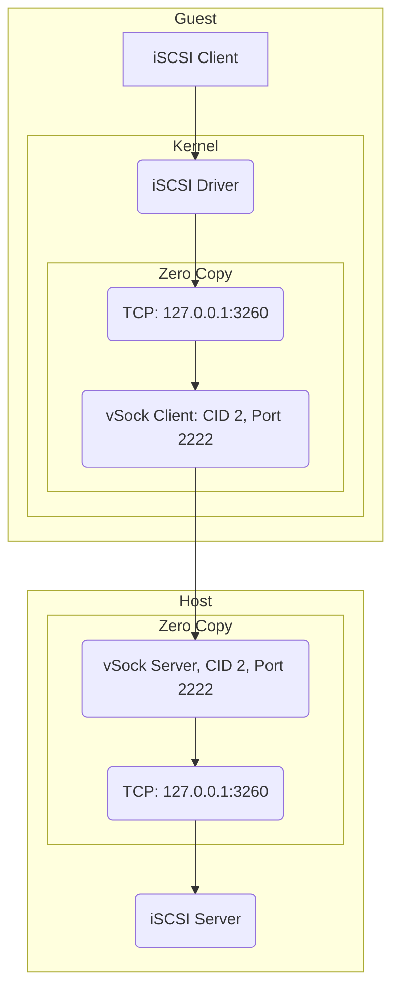

# vSCSI
iSCSI to vSock redirector 

# traffic flow

# try it
## On host
1. Install & start iSCSI service with default port 3260
2. `go run main.go -s`

## In GuestOS
1. Install open-iscsi
2. `go run main.go`
3. `iscsiadm --mode discovery --type sendtargets --portal 127.0.0.1`  
